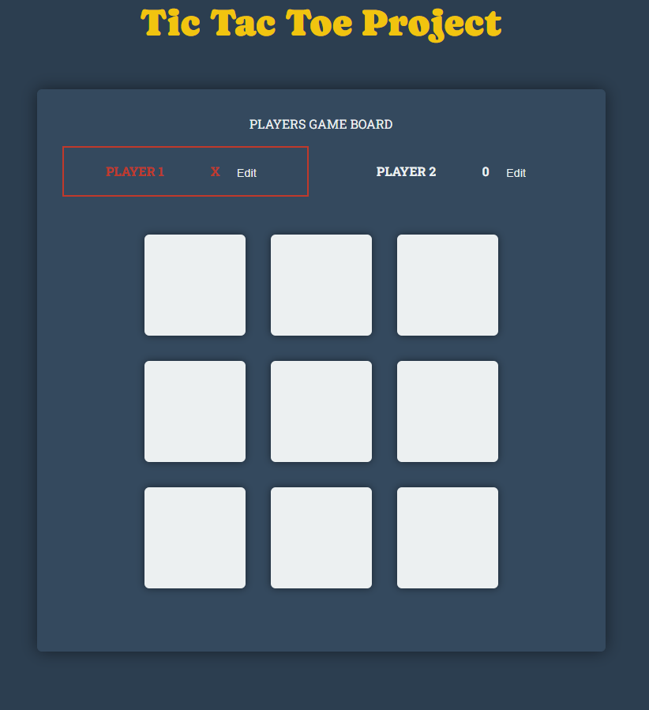
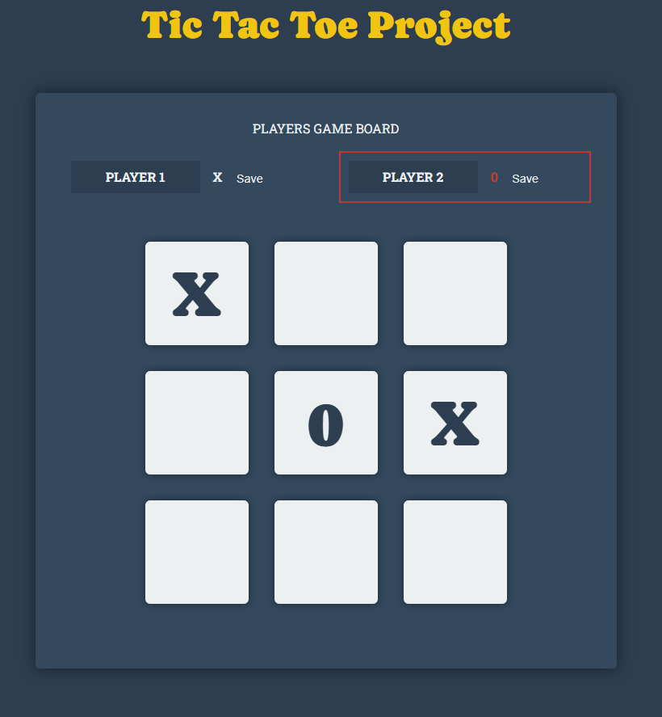
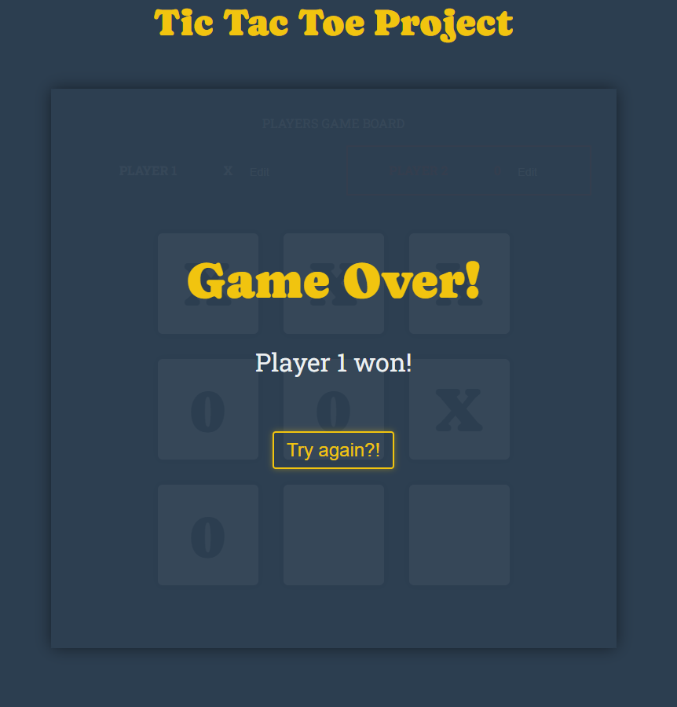

# Tic Tac Toe in React

A simple Tic Tac Toe application developed with React for educational purposes to learn the React basics. This application allows two players to take turns making moves and playing the game. It demonstrates the basic concepts of React, including components, state and event handling. A special focus for me was on the design of the application, as I like a simple yet elegant design.

## Demo

Here you can try it out: [Link to the Demo](https://js109.github.io/Tic_tac_toe_react)

## Functionality

- Two-player mode: Players can take turns making moves
- Display of the current score
- Possibility to customise player names
- Simple and user-friendly interface
- Possibility to start a new game after a completed game

## Frontend Technologies

- [React](https://react.dev/)
- [JavaScript](https://www.javascript.com/)
- [CSS](https://www.w3schools.com/css/)

## Installation
To run the application on your local computer, please follow these steps:

### Prerequisites
Ensure that Node.js is installed on your computer. Node.js is required to run the application and manage dependencies. You can download and install Node.js from the official website.

Steps to Run
Install Dependencies: First, you need to make sure all the required dependencies are installed. Open your terminal or command prompt and navigate to the directory of your application. Then, execute the following command:

``npm install``
This command will download and install all the necessary packages and libraries defined in the package.json file into your project.

Start the Application: Once the installation is complete, you can start the application. Enter the following command in the terminal:

``npm start``
This command will start the development server and open the application in your default web browser. You should now see the user interface of the Tic Tac Toe application and can start playing immediately!

## Some impressions:
<kbd></kbd>

<kbd></kbd>

<kbd></kbd>